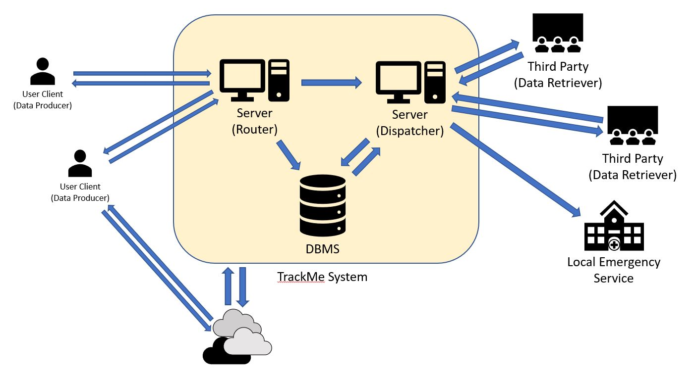
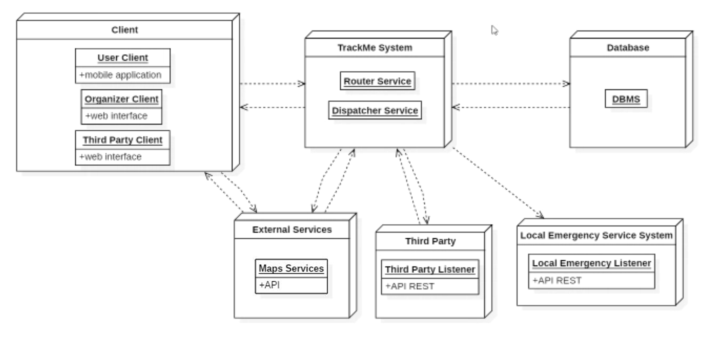

# Design Document

## 2. Overall Architecture

### 2.1 Overview

Depending on the functionality the system software should rely on different types of architecture, traditional requests are served via a Client-Server paradigm implementation while the most active operations are performed following the Publisher-Subscriber paradigm.

The system should be structured as follows:  
A server node and a Database Management System.  
The server node has the task to receive data from the registered users both sending it to the DBMS and elaborating it, along with checking if such data respect any possible constraints of the AutomatedSOSUser could have set, alerting the Emergency Service on need.
Upon new data arrival the server has the task to check if any of it matches filters of subscribed third parties and in such case proceeds to forward said data to the specific Third Party, it also has to handle Third Parties subscription requests, single filters request and emergency notifications, to achieve these tasks it is linked directly with the DBMS, for mapping and localization purposes both User's client and the TrackMe system communicate with external cloud services.
    
    

### 2.2 High Level Architecture

Below are described via a High Level Architechture graph the main components of our system and their main processes.  
The main core of our system is rapresented by the Router and Dispatcher processes in the TrackMe System, toghether with the DBMS that is accessed by them to read and store collected data.

The different Users of the services are provided with different Point Of Access depending on their needs, respectively implemented on different platforms like web browser for Organizers and Third Parties and mobile application for the data providing User.

### 2.3 Component View

- **LoginService** - Provides authentication and registration services including eventual parameters setting depending on the type of user (i.e. The insertion of AutomatedSOSUser's monitoring constraints are handled here).
- **DataCollectionService** - It is responsible for collecting and persistently storing in the Database the data received by the clients and sends them to: DataMonitoringService and SubscriptionService.
- **DataMonitoringService** - Receives data from the DataCollectionService and performs controls based on users imposed constraints previously stored in the DBMS.
- **SubscriptionService** - This service is responsible for managing subscriptions both receiving and storing them into the Database, it also receives real time data from DataCollectionService, if such data belong to subscribed topics it proceeds to forward those data to the PrivatizationService.
- **FilteringService** - Receives one-time data requests from Third Parties and queries the Database for the results to return to the DispatchingService, it is also responsible of forwarding eventual subscription requests on specified topics to the PrivatizationService.
- **PrivatizationService** - Receives data anonymization requests from other services and after processing user data forwards it to the DispatchingService.
- **DispatchingService** - Is responsible of forwarding Data matching subscriptions and filtering requests to Third Parties.
- **RoutingService** - This services takes care of handling various types of request received from users forwarding each of them to the appropriate service.
- **RunManagementService** - Is responsible for Subscription, Insertion and Spectating requests for the Track4Run Service.
