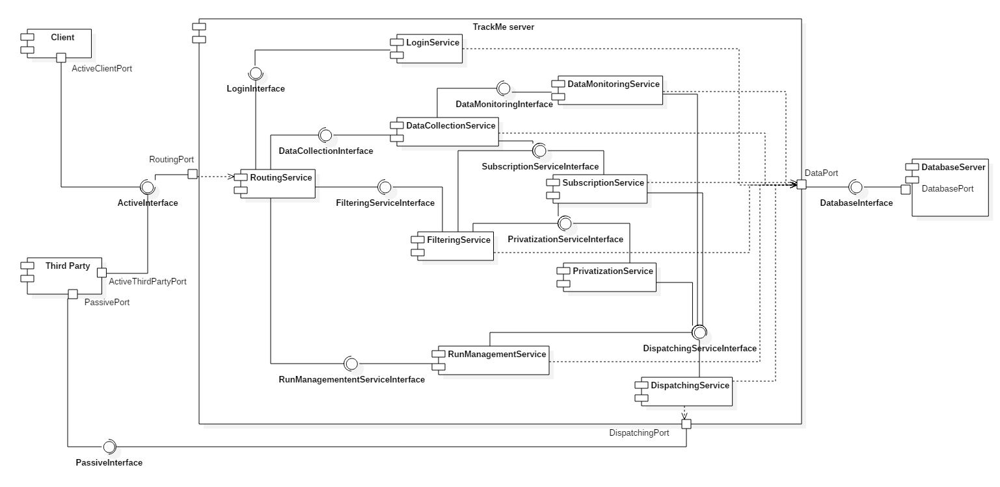

# Design Document

## 2. Overall Architecture

### 2.1 Overview

Depending on the functionality the system software should rely on different types of architecture, traditional requests are served via a Client-Server paradigm implementation while the most active operations are performed following the Publisher-Subscriber paradigm.

The system should be structured as follows:  
A server node and a Database Management System.  
The server node has the task to receive data from the registered users both sending it to the DBMS and elaborating it, along with checking if such data respect any possible constraints of the AutomatedSOSUser could have set, alerting the Emergency Service on need.
Upon new data arrival the server has the task to check if any of it matches filters of subscribed third parties and in such case proceeds to forward said data to the specific Third Party, it also has to handle Third Parties subscription requests, single filters request and emergency notifications, to achieve these tasks it is linked directly with the DBMS, for mapping and localization purposes both User's client and the TrackMe system communicate with external cloud services.
    
    

### 2.2 High Level Architecture and deployment

Below are described via a High Level Architechture graph the main components of our system and their main processes.  
The main core of our system is rapresented by the Router and Dispatcher processes in the TrackMe System, toghether with the DBMS that is accessed by them to read and store collected data.

The different Users of the services are provided with different Point Of Access depending on their needs, respectively implemented on different platforms like web browser for Organizers and Third Parties and mobile application for the data providing User.

### 2.3 Component View

In the following diagram we have depicted more accurately the services, the links between them and how they are interfaced with each other. Notice the DBMS interface is generalized because it depends on the choiche of the DBMS technology and in order to mantain things more general we didn't want to rule out any option.  
As for DBMS here the External Services are not specifically charachterized to allow a consequent choiche of the most appropriate service basing on the needs of the application.  

- **LoginService** - Provides authentication and registration services including eventual parameters setting depending on the type of user (i.e. The insertion of AutomatedSOSUser's monitoring constraints are handled here).
- **DataCollectionService** - It is responsible for collecting and persistently storing in the Database the data received by the clients and sends them to: DataMonitoringService and SubscriptionService.
- **DataMonitoringService** - Receives data from the DataCollectionService and performs controls based on users imposed constraints previously stored in the DBMS.
- **SubscriptionService** - This service is responsible for managing subscriptions both receiving and storing them into the Database, it also receives real time data from DataCollectionService, if such data belong to subscribed topics it proceeds to forward those data to the PrivatizationService and successively to the DispatchingService (or directly to it in case of specific user data request).
- **FilteringService** - Receives one-time data requests from Third Parties and queries the Database for the results to return to the DispatchingService, it is also responsible of forwarding eventual requests on specified topics to the PrivatizationService before forwarding it to the responsible service.
- **PrivatizationService** - Receives data anonymization requests from other services and after processing user data returning the result to the caller.
- **DispatchingService** - Is responsible of forwarding Data matching subscriptions and filtering requests to Third Parties.
- **RoutingService** - This services takes care of handling various types of request received from users forwarding each of them to the appropriate service.
- **RunManagementService** - Is responsible for Subscription, Insertion and Spectating requests for the Track4Run Service.

We assume that the routing functionality is responsible of forwarding messages to the directly interested services depending on the client that has performed the request. 

The diagram below describes the data model of the entire application, more specifically the data rapresentation in memory used by software components to achieve their objective.  
The dispatching functionality implemented by the dispatching service is built on top of the architecture described below:

Data management is operated by most of the services previously listed in their implementation such as FilteringService, SubscriptionService and PrivatizationService.  
The architecture is supposed to resemble the publish/subscribe paradigm, in order to achieve this type of communication, the data model includes information to reach the subscribed client everytime an appropriate update about the subscribed topic is performed.  
Information about where to send the subscription updates are collected upon registration from the Third Party.

Subscriptions are stored into the Database, on first boot the system loads in an appropriate data structure the tuples stored, extracting from the relational database couples of subscription topic and subscriber, thus strongly reducing the response time on each update to be performed.

## 2.4 Runtime View

### 2.4.1 Data4Help

#### Filtering Request

#### New Data Collection

        remember to describe the motivation why whe use async messages
        