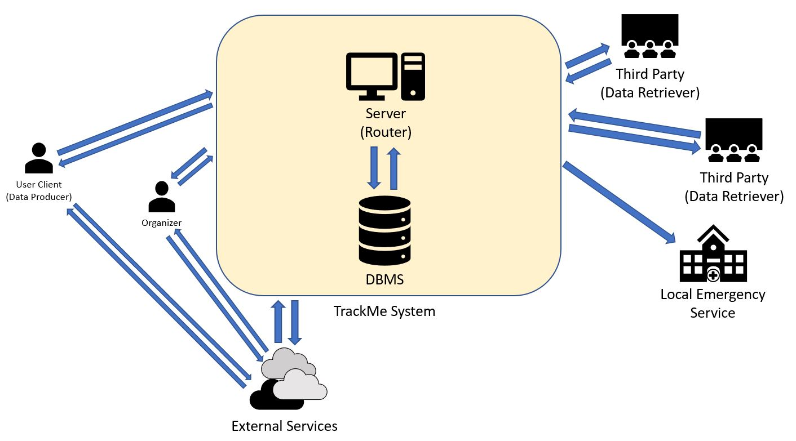
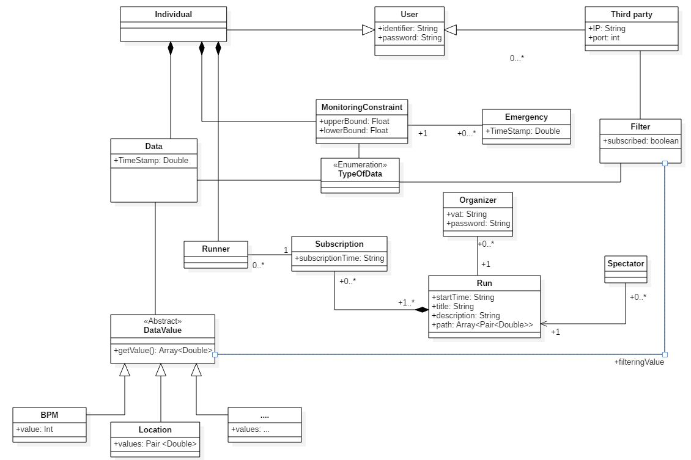

# Design Document

## 1 Introduction

### 1.1 Purpose

The purpose of this document is to provide a more technical description over the 
architecture of the TrackMe application system. The Design Document aim is to describe the architecture paradigm on wich the system should be based and its services' components (how they are connected to each other,
their main purpose and their runtime view). It also describes the implementation,
integration and testing plans.

### 1.2 Scope

### 1.3 Acronyms

API: Application programming interface  
DB : Database  
DBMS: Database Management System  
DD: Design Document  
JMQS: Java Message Queue Service.  

## 1.4 Document Structure

The first chapter gives an introduction to the DD explaining what is the aim of 
this document.

The second chapter illustrates via text description and graphs the
architecture and the components of the system underlying the connection between
them and their principal operations. Here there are also the sequence diagrams that
are used to describe the runtime view of the components.
At the end of the chapter there is a description of the selected architectural styles and patterns.

## 2. Overall Architecture

### 2.1 Overview

Depending on the functionality the system software should rely on different types of architecture, traditional requests are served via a Client-Server paradigm implementation while the most active operations are performed following the Publisher-Subscriber paradigm.

The system should be structured as follows:  
A server node and a Database Management System.  
The server node has the task to receive data from the registered users both sending it to the DBMS and elaborating it, along with checking if such data respect any possible constraints of the AutomatedSOSUser could have set, alerting the Emergency Service on need.
Upon new data arrival the server has the task to check if any of it matches filters of subscribed third parties and in such case proceeds to forward said data to the specific Third Party, it also has to handle Third Parties subscription requests, single filters request and emergency notifications, to achieve these tasks it is linked directly with the DBMS, for mapping and localization purposes both User's client and the TrackMe system communicate with external cloud services.
    
    

### 2.2 High Level Architecture and deployment

Below are described via a High Level Architechture graph the main components of our system and their main processes.  
The main core of our system is rapresented by the Router and Dispatcher processes in the TrackMe System, toghether with the DBMS that is accessed by them to read and store collected data.

The different Users of the services are provided with different Point Of Access depending on their needs, respectively implemented on different platforms like web browser for Organizers and Third Parties and mobile application for the data providing User.

### 2.3 Component View

In the following diagram we have depicted more accurately the services, the links between them and how they are interfaced with each other. Notice the DBMS interface is generalized because it depends on the choiche of the DBMS technology and in order to mantain things more general we didn't want to rule out any option.  
As for DBMS here the External Services are not specifically charachterized to allow a consequent choiche of the most appropriate service basing on the needs of the application.  

- **LoginService** - Provides authentication and registration services including eventual parameters setting depending on the type of user (i.e. The insertion of AutomatedSOSUser's monitoring constraints are handled here).
- **DataCollectionService** - It is responsible for collecting and persistently storing in the Database the data received by the clients and sends them to: DataMonitoringService and SubscriptionService.
- **DataMonitoringService** - Receives data from the DataCollectionService and performs controls based on users imposed constraints previously stored in the DBMS.
- **SubscriptionService** - This service is responsible for managing subscriptions both receiving and storing them into the Database, it also receives real time data from DataCollectionService, if such data belong to subscribed topics it proceeds to forward those data to the PrivatizationService and successively to the DispatchingService (or directly to it in case of specific user data request).
- **FilteringService** - Receives one-time data requests from Third Parties and queries the Database for the results to return to the DispatchingService, it is also responsible of forwarding eventual requests on specified topics to the PrivatizationService before forwarding it to the responsible service.
- **PrivatizationService** - Receives data anonymization requests from other services and after processing user data returning the result to the caller.
- **DispatchingService** - Is responsible of forwarding Data matching subscriptions and filtering requests to Third Parties.
- **RoutingService** - This services takes care of handling various types of request received from users forwarding each of them to the appropriate service.
- **RunManagementService** - Is responsible for Subscription, Insertion and Spectating requests for the Track4Run Service.

We assume that the routing functionality is responsible of forwarding messages to the directly interested services depending on the client that has performed the request. 

The diagram below describes the data model of the entire application, more specifically the data rapresentation in memory used by software components to achieve their objective.  
The dispatching functionality implemented by the dispatching service is built on top of the architecture described below:

Data management is operated by most of the services previously listed in their implementation such as FilteringService, SubscriptionService and PrivatizationService.  
The architecture is supposed to resemble the publish/subscribe paradigm, in order to achieve this type of communication, the data model includes information to reach the subscribed client everytime an appropriate update about the subscribed topic is performed.  
Information about where to send the subscription updates are collected upon registration from the Third Party.

Subscriptions are stored into the Database, on first boot the system loads in an appropriate data structure the tuples stored, extracting from the relational database couples of subscription topic and subscriber, thus strongly reducing the response time on each update to be performed.

### 2.4 Runtime View

#### 2.4.1 Data4Help

##### Filtering Request

##### New Data Collection

        remember to describe the motivation why whe use async messages
##### Emergency Notification

##### Run Enrollment

### 2.5 Component Intefaces

The aim of the following diagram is to highlight the relationships between services implemented on the server of the entire system, in particular the interfaces exposing their public methods and the use relation between them.

### 2.6 Selected architectural styles and patterns

The main architectural style adopted, on which the communication with third party relies, is the Publisher/Subscriber paradigm.  
It has been adopted to be able to manage the inherent transient nature of communication and asynchronicity of the services offered by the system. At the opposite the classical client-server architectural style doesn't fit with the purpose of queueing and dispatching of messages, as it would have made necessary establishing a new connection everytime the system had to send new data.  
This type of paradigm is used anyway on a different level in order to handle users' interactions via the provided interfaces, as for registration, run enrollment and other operations that can be performed in a single connection instance.

As described in the picture above, a part of the Database is devoted to store topics and subsricptions of Third Parties along with the pure application data.  
Upon receiving a new data the system performs a check on the subrsciptions and relative topics and eventually dispatches, after an optional further elaboration of the data operated by internal services, new information to the interested Third Parties.

The basical structure relies on a message queueing middleware (implemented by JMQS in our choiche) that ensures message ordering at receiver side and also recovery on message loss.

The address lookup database figured above, is stored in the system along with other data as described in the **<a href="#23-component-view">Component View Class Diagram</a>** : each record contains the EndPoint reference (Transport Level Address [IP, Port]) of the receivers of the service.

The system is designed to allow future scalability improvements on need i.e. by means of a routing application layer on top of which could be applied the current implementation to improve the delivery time by the usage of a routing algorithm and spreading the communication overhead on different nodes.

Notice that in order to model the server-side data context we adopted an objective memory representation, performing a one to one mapping with the relational model of the Database to obtain a faster access intermediate representation of the queried data, making them available to processes for elaboration.  
This type of rapresentation could be compared with the model part of the MVC pattern.

Regarding the client level the Individual user is provided with an application deployed on his mobile, interfacing with his activity monitoring device APIs that takes care both of allowing the user to interact with the services offered by the server and to communicate monitored data to the appropriate service.  
Third Parties for the Data4Help service and Organizers for Track4Run are provided with a web portal through which they can perform active interactions with the server such as sending Filtering Requests or creating a new Run for the Users, while passive interactions such as data-sending regarding subscriptions to certain topics are perfomed on a different channel, on the IP and port provided at the moment of registration and stored in the Database.

## 3. Requirements Traceability

##### [G1] - The user must be able to register on the platform as an individual or third party.

* **[R1] [R2]**  The LoginService interface provides three methods for registration, they takes differents arguments by which they allows different types of user to specify their credential and basic information needed by the system.

##### [G2] - The individual has to be monitored constantly.

* **[R3]** The DataCollectionService interface accomplishes this requirement providing the method addUserData through which fresh data are stored in the database of the system.

##### [G3] - Third party users must be able to access both individual's and group's data safely.

* **[R5] [R6] [R7]** The FilteringService interface along with the PrivatizationService one are responsible to control the cardinality of the group of individuals on which the request is based and remove any reference of the owners of the data provided. The method called "filterRequest()" is also capable to handle requests based on the SSN of the individual of interest.

##### [G4] - Third party users can choose to be notified about previous researches to be updated as soon as new data are available.

* **[R8] **  The requirement is implicitly fullfilled through the architectural style adopted.
* **[R9] ** DataCollectionService (notifyServices()), SubscriptionService (notifyNewData()) and DispatchingService (dispatchData()) together contribute to check subscription on arrival of new data and to (optionally) forward them to the subscribed users. 

##### [G5] - The individual is assured that when his/her data fall below certain selected thresholds, his/her local emergency service is notified.

* **[R10]**  The LoginService interface specifies a method registration() through which the AutomatedSOSUser is able to specify parameters and thresholds used to monitor his health status.

* **[R10] [R11]** DataMonitoringService receives the new data from DataCollectionService, checks the user's thresholds and forwards the Emergency that has to be notified to the DispatchingService, which contacts the Local Emergency Service.

##### [G6] - Users can register as organizers.

* **[R13]** The requirement is fullfiled by the registration method provided by the LoginService interface.

##### [G7] - Organizers can create runs.

* **[R14]**  RunManagementService interface exports the method createRun() that allows the organizers to specify the required parameters in order to insert a new run into the System.

##### [G8]  Any user can access Track4Run as a Guest (Spectator).

* **[R15] [R16]** RunManagementService implements two methods called getRunList() and spectateRun() through which the spectator is able to visualize all availble runs and to follow the one he/she selects.  

##### [G9] - Users can enroll to a run.

* **[R16]** As above, the method getRunList() allows to fulfill this requirement.

* **[R17]** RunManagementService allows a user to subscribe him/herself to a run via addRunSubscription method which exploits the LoginService interface to handle the login phase that is required in order to complete succesfully the registration.

##### [G10] - Spectators can follow the progress of an ongoing run.

    collegamento tra DataMonitoring e DispatchingServcie, togliere metodo privato da Component Interface diagram da DataMonitoringService, mettere collegamento tra RunManagement, DataCollectionService e DataDispatchingService. 

* **[R18]**  Once the spectator starts to follow a run, the DispatchingService contacted by the RunManagementService, sends the runners location on their arrival through the dispatchData() method.

## 4. Implementation, integration and testing plans 

### 4.1 Implementation plan

The way in which would be more appropriate to implement components and subsystem is described below. In the choice are mostly taken into account the inherent data centric nature of the services offered by TrackMe and the possible difficulties dealing with the JMSQ service.

According to what is said above, is easy to imagine the order listed below:

<ol> 
    <li>MVC Model resembling data structures  
        It will be very important to well identify and characterize data on which the services are based, not only to clarify as early as possible all these aspects but also because the whole server-side system will deal with them.
    </li>
    <li>DispatchingService  
        Considering possible difficulties on its implementation, caused by the strong use of external services, components and interfaces, (for instance Emergency Services APIs) it would be reasonable to start the implementation of this service as second step of the plan. The duration of the implementation is also another aspect taken into account making this choice.
    </li>
    <li>RunManagementService  
        This service, as shown in the appriopriate diagrams, is very application specific and contains a large number of methods. Following the criteria of anticipating as much as possible the implementation of the largest classes it's simple to choose this class as the third to be implemented. 
    </li>
    <li>DataCollectionService
        The main tasks of this service are the data managing, like the creation of appropriate and "real time needed" instances of the data structures, and the interaction with the DBMS, that results critical for the nature of the domain of the entire system; so the plan tackles all these aspects inserting this specific service just after the more critical servcies listed above. 
    </li>
    <li>FilteringService  
        Considering the strong interaction with the Database of this component, concretized by the intensive execution of queries, xalong with what is said above about this type of criticities, is a good choice to put the implementation just after the DataCollectionService one.
    </li>
    <li>All the others  
        The other services are in charge of executing actions that are not really application specific, for which a lot of consolidated algorithms have been already well known, so their implementation won't be as critical as for the previously listed services.
    </li>
</ol>

Notice that following this path it will be natural to follow a bottom up integration between components, avoiding the need of writing stubs that don't fit well with the development of this type of application. In fact, the injection of fake data, as a tecnique to write very specific drivers for many of the services (in the unit and intergation testing as well), results so natural, also if we consider the fact that real data won't be available until the deployment of the system.

