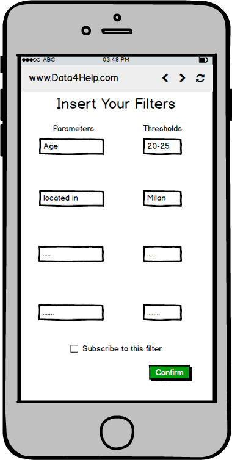
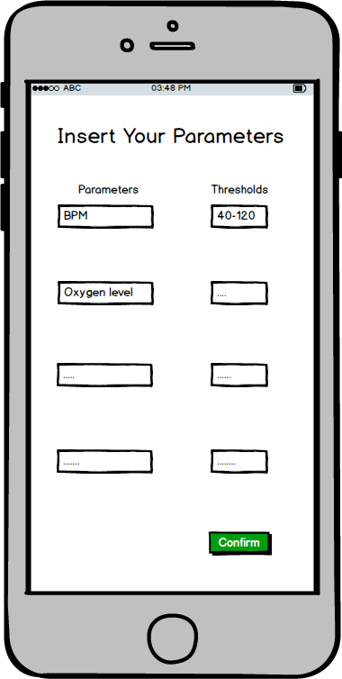
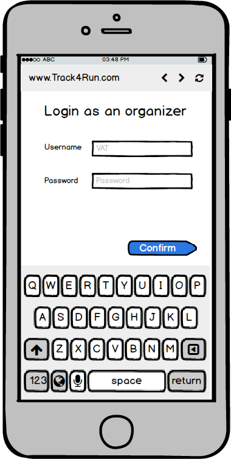
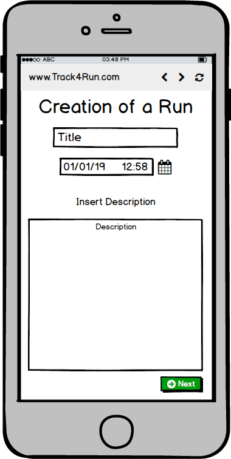
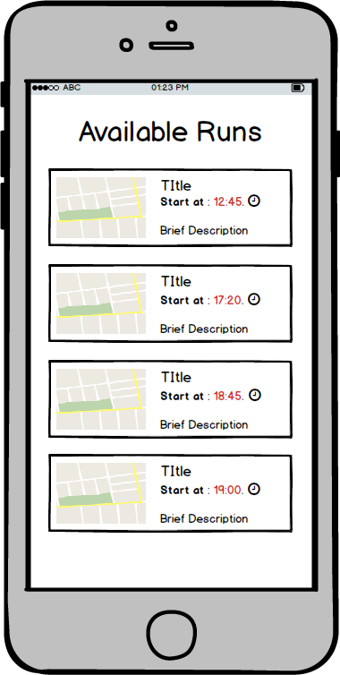
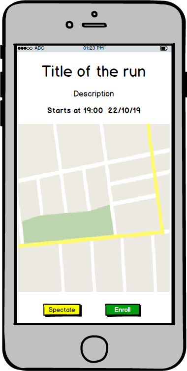
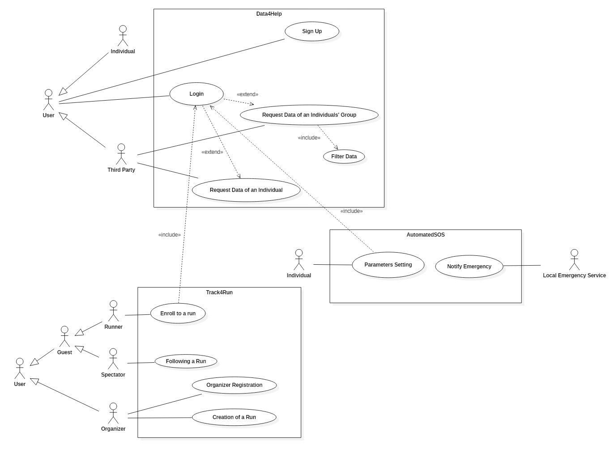
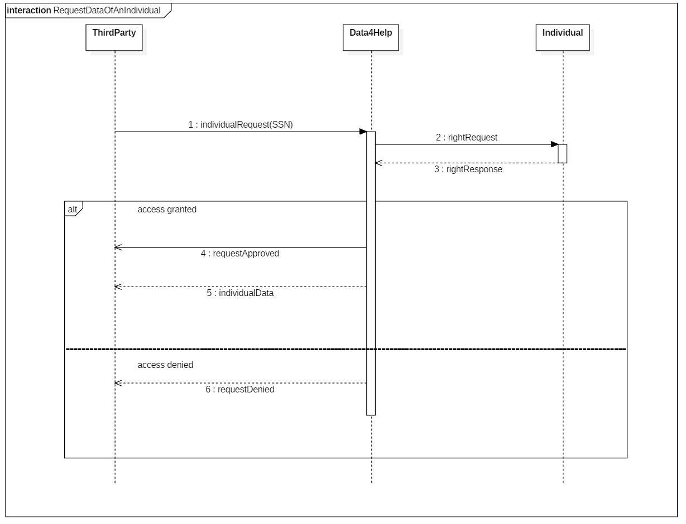
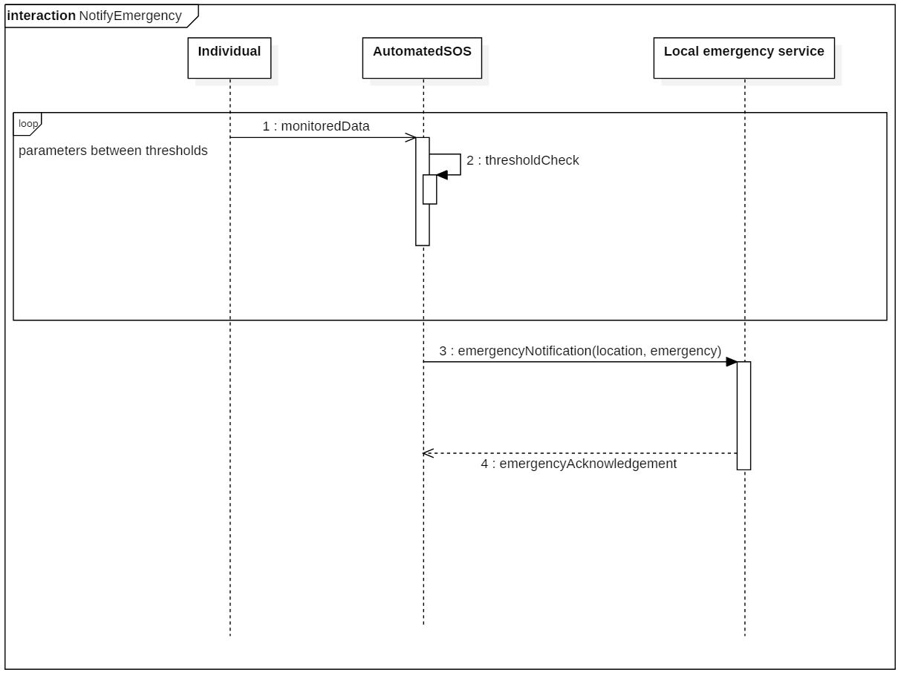
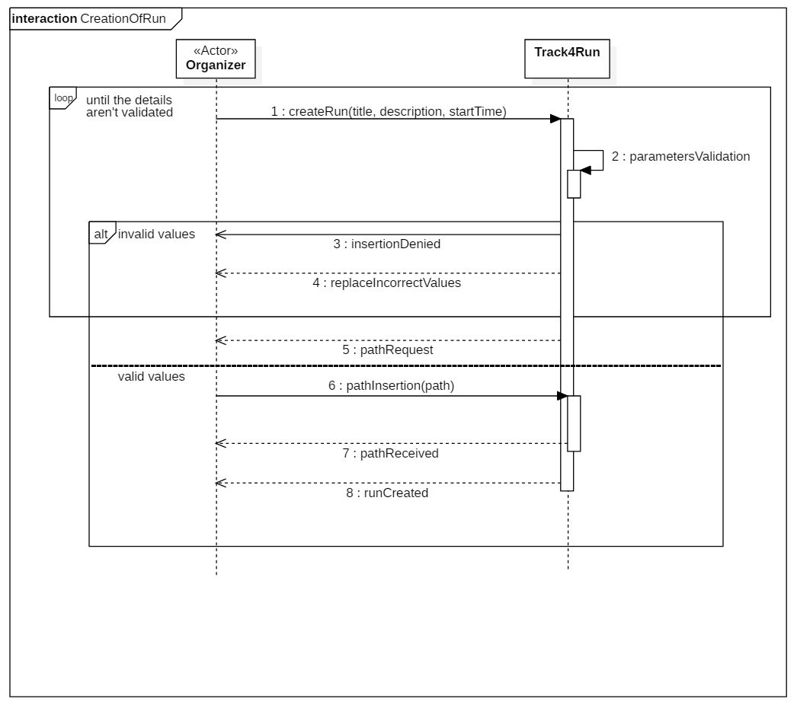

<link rel="stylesheet" type="text/css" media="all" href="./main.css" />

# RASD  

## Table of Contents  

[1.   INTRODUCTION](##introduction)  
   A.  Purpose  
    A.1 Goals  
   B.  Scope  
   C.  Definitions, Acronyms, Abbreviations   
   D.  Document Structure  (da rileggere)
   
2.   OVERALL DESCRIPTION  
  A.   Product perspective: class diagram.  
  B.   Product functions  
   B.1 Data monitoring and managing   
   B.2 Real time emergency notification  
   B.3 Creation and enrollment to a run  
  C.   User characteristics  
  D.   Assumptions, dependencies and constraints  
  
3.   SPECIFIC REQUIREMENTS  
  A.   External Interface Requirements  	
    A.1	 User Interfaces	  
    A.2	 Hardware Interfaces  	
    A.3	 Software Interfaces	  
    A.4	 Communication Interfaces  	
  B.   Functional Requirements: scenarios, goals in specific, use case diagrams, sequence diagrams  
    B.1 Functional Requirements Data4Help  
    B.2 Functional Requirements AutomatedSOS  
    B.3 Functional Requirements Track4Run  
    B.4 Scenarios  
    B.5 Use cases  
  C.   Software	System Attributes  	
    C.1   Reliability	   
    C.2   Availability	  
    C.3   Safety	  
    C.4	 Maintainability  	
    C.5	 Compatibility	  
   
4.   FORMAL ANALYSIS USING ALLOY  

5.   EFFORT	SPENT   

6.   REFERENCES  

        
##   1. Introduction

### A. Purpose

The purpose of the following document is to provide an overview of what are the requirements and goals of the system that the company, called TrackMe, wants to develop. The subject of the document is made up by three macro-functionalities that together concurr to give to the company customers a complete tracking, managing and share services of their personal data that nowadays are easily collectable with common  wearable devices.

Different type of stakeholders are addressed by the complex application, the three functionalities, in fact, try to separate in different levels this type of users, or stakeholders in general.  
The First, Data4Help is the most general-purpose one, it is addressed to any type of user that simply wants to be tracked and share their informations in a way in which their privacy is assured to be never violated, independently from what is the aim of the tracking. The sharing aspect of the application is given by the possibility of providing filters that can simply be referred to a single person, or to categories of users selected with respect to some constraint binded to the amount of people belonging to the specified category.  

**AutomatedSOS** is a specific service, it is addressed to elderly people that want to be sure that, in case of health problem, their wearable devices, collaborating with the system, can quickly contact the local emergency service in order to receive a proper assistance. AutomatedSOS gives the possibility to specify what are the critical parameters that have to be monitored and what are the correct values in which they are supposed to be, then periodically checks data, using the provided APIs to contact local services when anomalies appears.  

**Track4Run** is mainly addressed to runners, sports fan and organizers of running events. The service allows to choose, runs to which users want to subscribe or which they want to spectate, providing general information regarding the path, the starting time and a  description. Organizers mainly uses the application in order to collect subscription in an easy and distributed way. People that want to spectate runs, don't have to be logged to the service, they are simply able to follow the progress of the run on a map.  
**Data4Help** is the base layer of all the complex system, active users of **Track4Run** or **AutomatedSOS** are, in fact, previously registered to it, this is possible because of the general purpose of this component, though which specializing higher level functionalities and being open to new one is even simpler.

### A.1 Goals

#### Goals: Data4Help

* **[G1]**  The user must be able to register on the platform as an individual or third party.

* **[G2]**  The individual has to be monitored constantly.

* **[G3]**  Third party users must be able to access both individual's and group's data safely.

* **[G4]**  Third party users can subscribe to groups of data to be updated as soon as new data are available.

#### Goals: AutomatedSOS

* **[G5]** The individual is assured that when his/her data fall below certain selected thresholds, his/her local emergency service is notified.

#### Goals: Track4Run

* **[G6]**  Users can register as organizers.

* **[G7]**  Organizers can create runs.

* **[G8]**  Any user can access Track4Run as a Guest (Spectator).

* **[G9]**  Users can enroll to a run.

* **[G10]**  Spectators can follow the progress of a run.

### B. Scope

**Data4Help** is a service with the purpose of providing its users with two different tipe of services, people can sign up to Data4Help via their **SSN** in order to have their health parameters monitored along with their current position, meanwhile Third Parties can subscribe utilizing their **VAT** in order to request and retrieve both individuals' and groups' data.  
**Data4Help** handles groups' data requests having care of not disclosing informations that would compromise the anonimity of single individuals.  
Users data are registered thanks to monitoring devices (such as smart-watches, fitness tracker, etc).  

**Third Parties** can retrieve single individuals data, upon user confirmation, by using his **SSN** as a filter, and group's data by providing filters, wide enough to not violate the users privacy, regarding the collected data or anagraphical parameters. Privacy is assured adopting a simple policy that covers both the cases of individuals' and groups' requests: the first is simple passing the request to the individual addressed who can decide to accept or deny the access to his data, the second is managed internally by the system that returns data only if a sufficient number of users is addressed by the request.   

In addiction to this core service, two more targeted ones, **AutomatedSOS** and **Track4Run**, rely on it. This interaction allows the user to have his data shared across the three services on need, just by providing his own **Data4Help** credentials.  
**AutomatedSOS** takes the service offered by **Data4Help** to the next level to its subscribes users, in fact, as long as the registered users are provided with accurate enough monitoring devices, **AutomatedSOS** guarantees them to keep them constantly monitored, basing on parameters and thresholds provided at the moment of registration, reaching out to the user local emergency service within 5 seconds from when the emergency has been detected, communicating the location of the user and the type of emergency detected (basing on the set parameters).  

**Track4run** aims instead to offer a service on a complete different level, its users can be divided into two main categories: Organizers and final users.  
Organizers subscribe via their **VAT** and can use **Track4Run** to organize competitions by providing: title, path (drawning it on a map), starting time and a brief description, once this values are validated the run is created and inserted into a list of available runs for the final users.

Final users can be divided in two groups: runners and spectators, they both access the same section of the service as guest users, once they have selected a run from the available's list they can have two type of interactions: Either they enroll to the run, by accessing with their **Data4Help** account, for tracking purposes, or they choose to spectate the run, visualizing on a map the position of the runners on the track and their proceding.  
All of this is done by relying on the service **Data4Help** offers and the data it collects from the active users.

### C.  Definitions, Acronyms, Abbreviations

####  Definitions

- Location: the position of a user in a specific time
- Path: a route or track between one place and another
- Wearable device:  is a technology that is worn on the human body, that include tracking information related to health status and location of the user
- Threshold: it is a level on a scale, indicates the maximum or the minimum value of a parameter
- Starting time: the data and the hour of the beginning of the run
- Guest: user that access the application without a log in
- Critical parameters: the parameters indicated by the user that have to respect the thresholds 
- Filters: categories on which the data are sorted on every request

#### Acronyms

- SSN-social security number
- VAT-valued added tax
- BPM-beats per minute
- API-application programming interface
- GPS-global positioning system
- GDPR-general data protection regulation

#### Abbreviations  

[Gn]: n-th Goal  
[Dn]: n-th Domain assumption  
[Rn]: n-th Functional requirement

### D. Document structure

Chapter 1 is an introduction to the problem describing the purpose and the scope of the application. In order to describe fully the scope we have specified the goals of the application.  

Chapter 2 is an overall description of the project. The product perspective together with the class diagram describe the domain model of the system. The product functions describes the required functions of the system according with the goals. The possible actors are described in the user characteristics section. At the end there is a list of the taken domain assumption.

Chapter 3 gives a description of the external interface requirements such as user interfaces, software interfaces and communication interfaces. After this section there are the functional requirements that relate the goals with the domain assumptions and the requirements. After that the scenarios describe specific situation which are defined better via use case tables and sequence diagrams. Following this section there are the software system attributes.

Chapter 4 is dedicated to the alloy model genereting a possibile world.

Chapter 5 shows the effort spent by each group member on the various section of the project.

Chapter 6 includes the reference documents.

##   2.  Overall description

### A. Product perspective

The system described in this document is based on Data4Help, an underlying service that tracks and monitors its users providing also the possibility to retrieve data by third party users. AutomatedSOS  and Track4Run are two other functionalities that lay on top of this low applicational and service level, the first guarantees the notification of an emergency to the appropriate authorities and the second offers a platform on which users can create, enroll or spectate running competitions.

#### A.1 World and shared phenomena

##### World
<ul><li>Every individual owns a smartphone and a monitoring device</li><li>The monitoring device is always wear by the individual</li><li>Track4Run user running during a competition</li><li>An individual has an health disease</li></ul>  

##### Shared
<ul><li>Individuals own an SSN identifier</li><li>The third parties and the organizers own a VAT identifier</li><li>User data monitoring</li><li>An individual goes below thresholds and aid is provided (controlled by the world and observed by the machine)</li><li>Update of the location of the runner in a run. (controlled by the world and observed by the machine)</li></ul>

#### UML Class Diagram

### B. Product functions

#### B.1 Data monitoring and managing    
Monitoring devices, like activity trackers and smart-watches, are used by the system to collect data regarding individuals' activities. This data are stored to fulfill future requests by third parties concerning categories of individuals or a specific individual, guaranteeing to handle them safely according to the privacy constraints, not disclosing any data belonging to categories of too few individuals or that a specific individual didn't grant the access to.

#### B.2 Real time emergency notification  
A user interested in this kind of service has as a first step to specify the parameters which he needs to be monitored with their relative thresholds, AutomatedSOS upon recording those parameters begins to periodically check the health status of the user according to the request. When the monitoring contraints are violated an appropriate service is contacted by the application exploiting the communication services it offers.

#### B.3 Creation and enrollment to a run   
An organizer through Track4Run can create a run specifying the title, the path, a description (such as the motivation of the run, the sponsors..) and the starting time, inserting it into the list of competitions accessible by the users which upon selecting one of the listed runs and visualized the relative info-rmation can enroll to it until it has started (if the run is ongoing the user is notified that he can't enroll it). Similarly a user can decide to spectate the selected run following the progress of the runners on the track, users can't spectate a run that hasn't started yet.

### C. User characteristics

- Individuals: users subscribed and monitored by Data4Help
- Third parties: users subscribed to Data4Help that request data from it
- Organizers: users subscribed to Track4Run that create runs
- Runners: users subscribed to Data4Help that partecipate to a run of Track4Run
- Spectators: user logged as guest in Track4Run that spectate the progress of a run 

### D. Assumptions, dependecies and constrains

#### Domain Assumptions: Data4Help

* **[D1]**  Monitoring devices are always connected to the network.

* **[D2]**  Monitoring devices are provided with an accurate enough GPS.

* **[D3]**  Monitoring devices are capable of monitoring accurately Health parameters like: blood pressure, BPM, body temperature, steps, sleep quality, etc...

* **[D4]**  All individuals registered to Data4Help own a device capable of measuring all the parameteres required by the service application domain.

* **[D5]**  All third parties are capable of elaborate requests according to the types of data collected by the system.

* **[D6]**  Third party users are always available to receive data.

* **[D7]**  Third parties know the SSN of the individuals of interest.

* **[D8]**  Registering users must have accepted the service GDPR.

#### Domain Assumptions: AutomatedSOS

* **[D9]**  The users' local emergency services offer APIs to communicate emergencies.

* **[D10]**  The users' local emergency services are always available to receive emergency aid requests.

* **[D11]**  The user knows the parameters he needs to have monitored and the thresholds of those parameters.

* **[D12]** AutomatedSOS users are arleady registered to Data4Help as individuals.

#### Domain Assumptions: Track4Run

* **[D13]**  Track4Run is to organize No-Profit run so the system doesn't support payments.

* **[D14]**  Track4Run users that enroll a run also own a Data4Help account.

* **[D15]**  Users participating to a run must have their monitoring device equipped during the run.

* **[D16]**  Track4Run organizers cannot be Data4Help individuals.

* **[D17]**  Paths specified in runs must be feasible paths, not including obstacles of any genre.

##  3.  Specific Requirements

### A. External Interface Requirements

#### A.1 User interfaces

|||
|:-:|:-:|:-:
|Login to Data4Help|Filter Creation for Third Parties|AutomatedSOS Parameters Setting

|||
|:-:|:-:|:-:
|Login to Track4Run|Creation of a Run pt. 1|Creation of a Run pt. 2

|||
|:-:|:-:|:-:
|Available Runs|Details of a Run|Enrolling to a Run

#### A.2 Hardware Interfaces

The system to be able to execute its functionalities needs the following hardware interfaces: monitoring device provided with GPS and Bluetooth technologies, smartphone with an internet connection and software device that can support the web browsing funcionalities.

#### A.3 Software and Communication Interfaces 

Software requirements for the correct execution of the services are:
- Route maps: 
  - Google maps for the web-side application;
  - The default map service for the smartphone-side. 
- Local emergency service must provide an API to allow other servers to send an emergency notification affecting its emergency dispatching. 
- Communication interface: HTTP protocol used between the service and the user's hardware interfaces.  

###   B.  Functional Requirements

####   B.1  Functional Requirements Data4Help  
 
 
##### [G1] - The user must be able to register on the platform as an individual or third party.

* **[R1]**  Users can register to the platform through his/her SSN and password.

* **[R2]**  The application has to allow the registering user to sign up as an individual or as a third party.

##### [G2] - The individual has to be monitored constantly.

* **[D1]**  Monitoring devices are always connected to the network.

* **[D2]**  Monitoring devices are provided with an accurate enough GPS.

* **[D3]**  Monitoring devices are capable of monitoring accurately Health parameters like: blood pressure, BPM, body temperature, steps, sleep quality, etc...

* **[D4]**  All individuals registered to Data4Help own a device capable of measuring all the parameteres required by the service application domain.

* **[R3]**  The application has to keep a log of each data registered by the monitoring devices.
  
  
##### [G3] - Third party users must be able to access both individual's and group's data safely.

* **[D5]**  All third parties are capable of elaborate requests according to the types of data collected by the system.

* **[D7]**  Third parties know the SSN of the individuals of interest.

* **[R1]**  Users can register to the platform through his/her SSN and password.

* **[R5]**  The System has to allow third party users to filter data on request.
    - **[R5.1]**  Third party users can specify filters by the creation of categories to which the data previously collected belong.
    
* **[R6]**  The System provides the requested data only if there are at least 1000 users belonging to the selcted filter.

* **[R7]**  The System allows the third party to obtain a specific individual data only if he/she grants the acces to them.
   
   
##### [G4] - Third party users can choose to be notified about previous researches to be updated as soon as new data are available.

* **[D6]**  Third party users are always available to receive data.

* **[R8]**  The System keeps track of the last update sent to the third party.

* **[R9]**  The System periodically checks if new data belonging to the subscribed filter are available and sends a proper update.

* **[R10]**  The System periodically checks if new data belonging to the subscribed filter are available and sends a proper update.

####   B.2  Functional Requirements AutomatedSOS 

##### [G5] - The individual is assured that when his/her data fall below certain selected thresholds, his/her local emergency service is notified.

* **[D9]**  The users' local emergency services offer APIs to communicate emergencies.

* **[D10]**  The users' local emergency services are always available to receive emergency aid requests.

* **[D11]**  The user knows the parameters he needs to have monitored and the thresholds of those parameters.

* **[R11]**  The user can specify his/her own parameters and thresholds to be monitored into the application.

* **[R12]**  The application monitors periodically the individual data with respect to the previously specified parameters.

* **[R13]**  The application notifies the user's local emergency services when his parameters fall below specified thresholds.

####   B.3  Functional Requirements Track4Run  

##### [G6] - Users can register as organizers.

* **[D16]**  Track4Run organizers cannot be Data4Help individuals.

* **[R14]**  On first login users can provide their VAT number to obtain access to the system as organizers of runs.

##### [G7] - Organizers can create runs.

* **[D17]**  Paths specified in runs must be feasible paths, not including obstacles of any genre.

* **[R15]**  Organizers can specify the path, the title, the date, the start time and a brief description of the run they are creating.

##### [G8]  Any user can access Track4Run as a Guest (Spectator).

* **[R16]**  Guest users can access Track4Run data on a specific run without any credential.

* **[R17]**  Users can visualize title, description, date, start time and path of available runs.

##### [G9] - Users can enroll to a run.

* **[D14]**  Track4Run users that enroll a run also own a Data4Help account.

* **[R17]**  Users can visualize title, description, date, start time and path of available runs.

* **[R18]**  Users can subscribe to a selected run using his/her Data4Help account.

##### [G10] - Spectators can follow the progress of an ongoing run.

* **[D14]**  Track4Run users that enroll a run also own a Data4Help account.

* **[D15]**  Users participating to a run must have their monitoring device equipped during the run.

* **[R17]**  Users can visualize title, description, date, start time and path of available runs.

* **[R18]**  Spectator can visualize the location of each participant to a selected run.

#### B.4 Scenarios

##### Scenario 1

A basketball team coach wants to adopt a new training method that requires him to monitor constantly the players, so he asks them to subscribe to **Data4Help** and allow him to access their data.
The players subscribes to Data4Help inserting their SSN, a password and filling the mandatory fields, such as Name, Surname, Age, Residency and so on and so forth.
He proceeds to register himself as a **third party**, then he requests via SSN the players' data. Data4Help forwards the requests to the **specified users**, and as previously agreed, they accept, and so from now on the coach can track his team.

##### Scenario 2

A statistic institute wants to conduct a research on the health status of **people aged 25** in Romano di Lombardia, in order to collect the nedeed data they decide to exploit the service offered by Data4Help, so they specify their data preferences on Data4Help portal. 
Since the request doesn't fit the privacy constraints of the service, the acces to the data is denied, the institute sends a new request widening the search to people between 24 and 26 years old. Now the request fits the privacy constraints and Data4Help sends the specified data to the institute.

##### Scenario 3

Giovanni is 80 years old and suffers of a heart disease, since he lives alone he decided to register to **AutomatedSOS**.  
On first access to the service he specified the **thresholds** of his heartbeat outside of which he wants to be assisted by his local **emergency service**. One morning, while working in his backyard, he has a tachycardia attack, as soon as it is decteded my his monitoring device, **AutomatedSOS** alerts his local first aid specifying Giovanni's location.

##### Scenario 4

Luca is a user of Data4Help, he is a passionate runner, he heard that Data4Help is offering a new service to allow runners to patecipate to organized competitions. He decides to exploit this opportunity and accesses to Track4Run as a guest. He visualizes all the available runs and selects the closest to his position and enrolls inserting his Data4Help credentials. Luca can now attend the competition 

#### B.5 Use cases

##### Use Case Diagram

##### Data4Help - use cases

| Name                                                               |Sign up
|:-------------------------------------------------------------------|:-
| Actor                                                              |User
| Entry conditions                                                   |The user has installed the application on his/her device
| Events flows                                                       |<ol><li>The user click on "Sign up as individual" or "sign up as third party" button</li><li>The user provides the SSN for the individuals, or the VAT for the third party, a valid password and fills all the mandatory fields about his/her personal data </li><li>The user clicks on "Confirm" button</li><li>The system saves the data</li></ol>
| Exit conditions                                                    |The user has successfully registered
| Exceptions                                                         |<ol><li> The user is already signed up</li><li>The user didn't fill all of the mandatory fields with valid data</li></ol> All the excpetions are handled by notifying the user and taking him back to the sign up activity

| Name                                                               |Log in
|:-------------------------------------------------------------------|:-
| Actor                                                              |Third party
| Entry conditions                                                   |The third party is successfully submitted to the service
| Events flows                                                       |<ol><li> The third party enters his credentials in the "VAT/SSN" and "PASSWORD" fields</li><li>The third party clicks on the "Log in" button  </li><li> The third party is successfully logged in Data4Help</li></ol>
| Exit conditions                                                    |The third party is redirected to the select filters' interface
| Exceptions                                                         |The third party enters invalid credentials   The exception is handled by notifying the third party and taking him back to the log in activity

| Name                                                               |Filter data
|:-------------------------------------------------------------------|:-
| Actor                                                              |Third party
| Entry conditions                                                   |The third party selected the functionality to request data from a group of individuals
| Events flows                                                       |<ol><li> The third party specifies the filtering values accordingly with the previously data inserted by the individuals upon registration </li><li> The third party specify if he wants to be subscribed to the data </li></ol> 
| Exit conditions                                                    |The request is correctly sent
| Exceptions                                                         |<ol><li>The third party inserts a non valid value in the filtering fields</li></ol>  The exception is handled by prompting the third party to replace the incorrect values

| Name                                                               |Request data of an individual
|:-------------------------------------------------------------------|:-
| Actor                                                              |Third party, individual
| Entry conditions                                                   |The third party is logged in
| Events flows                                                       |<ol><li>The third party selects the functionality to request data from an individual</li><li> The third party inserts the SSN of the individual of interest</li><li>Data4Help forwards the request to the specified individual</li><li>The individual accepts the request to access the data</li></ol>
| Exit conditions                                                    |Data4Help provides the third party with the requested data
| Exceptions                                                         |<ol><li>The individual refuses to grant the access to his/her data</li><li>The individual isn't registered to Data4Help</li></ol>  Both exceptions are handled notifying that the requested data are not accessible

| Name                                                               |Request data of an individuals' group
|:-------------------------------------------------------------------|:-
| Actor                                                              |Third party
| Entry conditions                                                   |The third party is logged in
| Events flows                                                       |<ol><li>  The third party selects the functionality to request data from a group of individuals</li><li> The third party enters in the "filter data" use case to properly select the categories to which the interest data belong</li></ol>
| Exit conditions                                                    |Data4Help provides the third party with the requested data
| Exceptions                                                         |<ol><li>The request doesn't fit the privacy constraints of Data4Help</li></ol>  The exception is handled notifying that the requested data are not accessible and requesting to select new filters

##### AutomatedSOS - use cases

| Name                                                               |Parameters setting
|:-------------------------------------------------------------------|:-
| Actor                                                              |User
| Entry conditions                                                   |<ul><li>The individual is registered to Data4Help</li><li>The individual is accessing for the first time</li></ul>
| Events flows                                                       |<ol><li> The individual logs in with the Data4Help account</li><li> AutomatedSOS asks the client to insert the threshold of the parameters on wich he wants to be monitored </li></ol>
| Exit conditions                                                    |AutomatedSOS notifies the user that it started to monitor the specified parameters
| Exceptions                                                         |<ol><li>The individual inserts a non valid value in the parameters fields</li></ol>  The exception is handled requesting again the value

    
| Name                                                               |Notify emergency
|:-------------------------------------------------------------------|:-
| Actor                                                              |AutomatedSOS, individual
| Entry conditions                                                   |The individual's parameters go outside the thresholds
| Events flows                                                       |<ol><li> AutomatedSOS detects that certain parameters aren't in the specified thresholds</li><li>AutomatedSOS tracks down the location of the individual</li><li> AutomatedSOS signals to the local emergency service the user location and the type of the emergency </li></ol>
| Exit conditions                                                    |The local emergency service replies to AutomatedSOS that the emergency has been correctly delivered 
| Exceptions                                                         | 

##### Track4Run - use cases

| Name                                                               |Organizer registration
|:-------------------------------------------------------------------|:-
| Actor                                                              |User
| Entry conditions                                                   |The user has to organize a run
| Events flows                                                       |<ol><li> The user registers as an organizer providing the VAT </li></ol>
| Exit conditions                                                    |Track4Run notifies that the organizer is correctly subscribed to the service
| Exceptions                                                         |<ol><li>The user was already subscribed</li></ol>  The exception is handled by notifying the presence of the user

| Name                                                               |Creation of a run
|:-------------------------------------------------------------------|:-
| Actor                                                              |Organizer
| Entry conditions                                                   |Organizer is registered to the service
| Events flows                                                       |<ol><li>The organizer logs into the system with his credentials</li><li>The organizer chooses to create a new run</li><li>Track4Run asks the organizer the title of the run to create</li><li>The organizer inserts a title for the run</li><li>Track4Run prompts to fill-in the description and the start time fields of the run</li><li>The Organizer inserts description and start time</li><li> Track4Run validates the inserted details and prompts the user to draw the designed path on a map</li><li>The organizer draws the path</li></ol>
| Exit conditions                                                    |Track4Run notifies the organizer that the run has been correctly inserted in the system
| Exceptions                                                         |<ol><li>The credentials used to login are invalid</li><li>The title is already in the system</li><li>The start time isn't consistent</li></ol>  The exception are handled by notifying the organizer to refill the wrong fields

| Name                                                               |Enrolling to a run
|:-------------------------------------------------------------------|:-
| Actor                                                              |Individual
| Entry conditions                                                   |<ul><li>The individual is registered to Data4Help</li><li>There is at least one run available</li></ul>
| Events flows                                                       |<ol><li>The individual accesses the list of the available runs (as a guest)</li><li> The individual selects the run which he/she wants to enroll to</li><li>Track4Run asks the user if he wants to enroll the competition or to spectate the run</li><li>The user chooses the enroll option</li><li>Track4Run requires his/her Data4Help credentials</li><li>The individual inputs the required credentials</li></ol>
| Exit conditions                                                    |Track4Run notifies the user that he is correctly enrolled to the run
| Exceptions                                                         |<ol><li>The individual inserts wrong credentials, the exception is handled inviting the user to refill the wrong fields</li><li>The run is already started, the exception is handled notifying the user that he can't enroll anymore</li></ol>

| Name                                                               |Following a run
|:-------------------------------------------------------------------|:-
| Actor                                                              |Spectator
| Entry conditions                                                   |<ul><li>There is at least one run available</li></ul>
| Events flows                                                       |<ol><li>The spectator accesses Track4Run as a guest</li><li>The spectator selects a run that he wants to follow from the list of available runs</li><li>Track4Run asks the user if he wants to enroll the competition or to spectate the run</li><li>The user selects the spectate option</li><li>Track4Run prompts the user with the track of the competition, periodically updating the position of the runners</li></ol>
| Exit conditions                                                    |The followed run has reached the end
| Exceptions                                                         |<ol><li>The selected run has not started yet, Track4Run notifies it to the user</li></ol>

#### Use case sequence diagram - Data4Help

#### Use case sequence diagram - AutomatedSOS

#### Use case sequence diagram - Track4Run

	
### C. Software system attributes

#### C.1 Reliability

AutomatedSOS has to guarantee to be online 24/7, accordingly to its function of monitoring periodically the data collected and sending notification to external entities. Track4Run systems hasn't this type of constraints concerning reliability, because of its nature that is unrelated from an emergency application domain, it is acceptable that the service has some (short) period of time of unreachability, clearly guaranteeing that almost part of an entire run progress will be covered. 
Assuming that Data4Help represents the collecting service on which AutomatedSOS is based and condisering what is said above about it, Data4Help has to be 24/7 connected with the users' devices, ready to receive monitoring data.

#### C.2 Availability

Working correctly at any time (limited by future infrastructure choices) is a constraint for AutomatedSOS and Data4Help, in fact if the failure time is overlapped with the time in which an health anomaly occurs, the emergency won't be catched by the system and the function of the application won't be accomplished. On the opposite side with Track4Run is possible to relax this requests because the goals of the system  don't implicate that it has to work correctly every time.

#### C.3 Safety

According with the domain assumption D13 that runs in Track4Run are no-profit events and that in the entire system there aren't any type of payment information exchanged between parties, the security implemented at the application level can be satisfying for the purpose of the application. The anonymisation of data operated by the system at the highest level (not considering any encryption at the HTTP level) is implemented by the application itself and so it's not necessary any further requirement about this scope of interest.

#### C.4 Mantainability

since the nature of these three whole services is heavily binded (two of them directly rely on the main one for most of their functions), the system should be flexible and easy to mantain, as long as certain external constraints, such as the communication with monitoring devices or other services' APIs are respected. Certainly following the design patterns will play a fundamental role on the application mantainability.  
Having a good documentation will be of key importance for the developers to achieve a good level of mantainability and clarifying the patterns to adopt on each case.

#### C.5 Compatibility

These services offer downloadable applications for individual users on their smartphone in order to connect with their monitoring device and record data anytime, moreover they are compatible with any monitoring device which are capable of monitoring the healt status of the individual. The services can be also accessed via web pages both for individuals and third parties to make use of the functions offered. 

##   4.  Formal analysis using alloy

##   5.  Effort spent

#### Leonardo

|Section                               |Time spent
|--------------------------------------|----------
|Purpose                               | 2H
|Scope                                 | 1H
|Goals                                 | 3H
|Domain Assumptions                    | 3H
|Requirements                          | 3H
|Use Case Diagram                      | 2H
|Sequence Diagram                      | 4H
|Class Diagram                         | 1H
|Software System Attributes            | 1H
|User interfaces                       | 1H
|Hardware-Software Interfaces          | 2H

#### Gabriele

|Section                               |Time spent
|--------------------------------------|----------
|Purpose                               | 0H
|Scope                                 | 2H
|Goals                                 | 3H
|Domain Assumptions                    | 3H
|Requirements                          | 3H
|Use Case Diagram                      | 2H
|Sequence Diagram                      | 4H
|Class Diagram                         | 1H
|Software System Attributes            | 1H
|User interfaces                       | 1H
|Hardware-Software Interfaces          | 2H

#### Gianmarco

|Section                               |Time spent
|--------------------------------------|----------
|Purpose                               | 1H
|Scope                                 | 2H
|Goals                                 | 3H
|Domain Assumptions                    | 3H
|Requirements                          | 3H
|Use Case Diagram                      | 2H
|Sequence Diagram                      | 4H
|Class Diagram                         | 1H
|Software System Attributes            | 1H
|User interfaces                       | 2H
|Hardware-Software Interfaces          | 2H  

## 6. References

<ul><li>Specification document "A.Y.2018-2019 Software Engineering 2 Mandatory Project</li><li>Slides-"Requirements engineering part I and II"</li><li>Alloy documentation - http://alloy.mit.edu/alloy/documentation.html </li><li>Slides-"Alloy"</li></ul>
