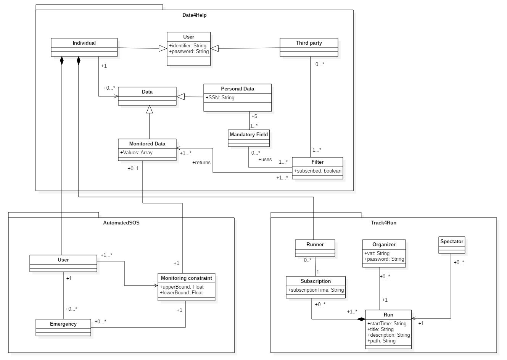

<link rel="stylesheet" type="text/css" media="all" href="./main.css" />

# RASD

        //TODO: sequence diagrams, scope description*, introduction*, Alloy, interface and constraints*.
        
## Introduction

////TODO

## Goals: Data4Help

* **[G1]**  The user must be able to register on the platform as an individual or third party.

* **[G2]**  The individual has to be monitored constantly.

* **[G3]**  Third party users must be able to access both individual's and group's data safely.

* **[G4]**  Third party users can subscribe to groups of data to be updated as soon as new data are available.

## Goals: AutomatedSOS

* **[G5]** The individual is assured that when his/her data fall below certain selected thresholds, his/her local emergency service is notified.

## Goals: Track4Run

* **[G6]**  Users can register as organizers.

* **[G7]**  Organizers can create runs.

* **[G8]**  Any user can access Track4Run as a Guest (Spectator).

* **[G9]**  Users can enroll to a run.

* **[G10]**  Spectators can follow the progress of a run.

## Domain Assumptions: Data4Help

* **[D1]**  Monitoring devices are always connected to the network.

* **[D2]**  Monitoring devices are provided with an accurate enough GPS.

* **[D3]**  Monitoring devices are capable of monitoring accurately Health parameters like: blood pressure, BPM, body temperature, steps, sleep quality, etc...

* **[D4]**  All individuals registered to Data4Help own a device capable of measuring all the parameteres required by the service application domain.

* **[D5]**  All third parties are capable of elaborate requests according to the types of data collected by the system.

* **[D6]**  Third party users are always available to receive data.

* **[D7]**  Third parties know the SSN of the individuals of interest.

* **[D8]**  Registering users must have accepted the service GDPR.

## Domain Assumptions: AutomatedSOS

* **[D9]**  The users' local emergency services offer APIs to communicate emergencies.

* **[D10]**  The users' local emergency services are always available to receive emergency aid requests.

* **[D11]**  The user knows the parameters he needs to have monitored and the thresholds of those parameters.

* **[D12]** AutomatedSOS users are arleady registered to Data4Help as individuals.

## Domain Assumptions: Track4Run

* **[D13]**  Track4Run is to organize No-Profit run so the system doesn't support payments.

* **[D14]**  Track4Run users that enroll a run also own a Data4Help account.

* **[D15]**  Users participating to a run must have their monitoring device equipped during the run.

* **[D16]**  Track4Run organizers cannot be Data4Help individuals.

* **[D17]**  Paths specified in runs must be feasible paths, not including obstacles of any genre.

## Functional Requirements: Data4Help
 
#### [G1] - The user must be able to register on the platform as an individual or third party.

* **[R1]**  Users can register to the platform through his/her SSN and password.

* **[R2]**  The application has to allow the registering user to sign up as an individual or as a third party.

#### [G2] - The individual has to be monitored constantly.

* **[D1]**  Monitoring devices are always connected to the network.

* **[D2]**  Monitoring devices are provided with an accurate enough GPS.

* **[D3]**  Monitoring devices are capable of monitoring accurately Health parameters like: blood pressure, BPM, body temperature, steps, sleep quality, etc...

* **[D4]**  All individuals registered to Data4Help own a device capable of measuring all the parameteres required by the service application domain.

* **[R3]**  The application has to keep a log of each data registered by the monitoring devices.
  
  
#### [G3] - Third party users must be able to access both individual's and group's data safely.

* **[D5]**  All third parties are capable of elaborate requests according to the types of data collected by the system.

* **[D7]**  Third parties know the SSN of the individuals of interest.

* **[R1]**  Users can register to the platform through his/her SSN and password.

* **[R5]**  The System has to allow third party users to filter data on request.
    - **[R5.1]**  Third party users can specify filters by the creation of categories to which the data previously collected belong.
    
* **[R6]**  The System provides the requested data only if there are at least 1000 users belonging to the selcted filter.

* **[R7]**  The System allows the third party to obtain a specific individual data only if he/she grants the acces to them.
   
   
#### [G4] - Third party users can choose to be notified about previous researches to be updated as soon as new data are available.

* **[D6]**  Third party users are always available to receive data.

* **[R8]**  The System keeps track of the last update sent to the third party.

* **[R9]**  The System periodically checks if new data belonging to the subscribed filter are available and sends a proper update.

* **[R10]**  The System periodically checks if new data belonging to the subscribed filter are available and sends a proper update.

#### [G5] - The individual is assured that when his/her data fall below certain selected thresholds, his/her local emergency service is notified.

* **[D9]**  The users' local emergency services offer APIs to communicate emergencies.

* **[D10]**  The users' local emergency services are always available to receive emergency aid requests.

* **[D11]**  The user knows the parameters he needs to have monitored and the thresholds of those parameters.

* **[R11]**  The user can specify his/her own parameters and thresholds to be monitored into the application.

* **[R12]**  The application monitors periodically the individual data with respect to the previously specified parameters.

* **[R13]**  The application notifies the user's local emergency services when his parameters fall below specified thresholds.

#### [G6] - Users can register as organizers.

* **[D16]**  Track4Run organizers cannot be Data4Help individuals.

* **[R14]**  On first login users can provide their VAT number to obtain access to the system as organizers of runs.

#### [G7] - Organizers can create runs.

* **[D17]**  Paths specified in runs must be feasible paths, not including obstacles of any genre.

* **[R15]**  Organizers can specify the path, the title, the date, the start time and a brief description of the run they are creating.

#### [G8]  Any user can access Track4Run as a Guest (Spectator).

* **[R16]**  Guest users can access Track4Run data on a specific run without any credential.

* **[R17]**  Users can visualize title, description, date, start time and path of available runs.

#### [G9] - Users can enroll to a run.

* **[D14]**  Track4Run users that enroll a run also own a Data4Help account.

* **[R17]**  Users can visualize title, description, date, start time and path of available runs.

* **[R18]**  Users can subscribe to a selected run using his/her Data4Help account.

#### [G10] - Spectators can follow the progress of an ongoing run.

* **[D14]**  Track4Run users that enroll a run also own a Data4Help account.

* **[D15]**  Users participating to a run must have their monitoring device equipped during the run.

* **[R17]**  Users can visualize title, description, date, start time and path of available runs.

* **[R18]**  Spectator can visualize the location of each participant to a selected run.

## UML Class Diagram

## Scenarios

#### Scenario 1

A basketball team coach wants to adopt a new training method that requires him to monitor constantly the players, so he asks them to subscribe to **Data4Help** and allow him to access their data.
The players subscribes to Data4Help inserting their SSN, a password and filling the mandatory fields, such as Name, Surname, Age, Residency and so on and so forth.
He proceeds to register himself as a **third party**, then he requests via SSN the players' data. Data4Help forwards the requests to the **specified users**, and as previously agreed, they accept, and so from now on the coach can track his team.

#### Scenario 2

A statistic institute wants to conduct a research on the health status of **people aged 25** in Romano di Lombardia, in order to collect the nedeed data they decide to exploit the service offered by Data4Help, so they specify their data preferences on Data4Help portal. 
Since the request doesn't fit the privacy constraints of the service, the acces to the data is denied, the institute sends a new request widening the search to people between 24 and 26 years old. Now the request fits the privacy constraints and Data4Help sends the specified data to the institute.

#### Scenario 3

Giovanni is 80 years old and suffers of a heart disease, since he lives alone he decided to register to **AutomatedSOS**.  
On first access to the service he specified the **thresholds** of his heartbeat outside of which he wants to be assisted by his local **emergency service**. One morning, while working in his backyard, he has a tachycardia attack, as soon as it is decteded my his monitoring device, **AutomatedSOS** alerts his local first aid specifying Giovanni's location.

#### Scenario 4

Luca is a user of Data4Help, he is a passionate runner, he heard that Data4Help is offering a new service to allow runners to patecipate to organized competitions. He decides to exploit this opportunity and accesses to Track4Run as a guest. He visualizes all the available runs and selects the closest to his position and enrolls inserting his Data4Help credentials. Luca can now attend the competition 

# Use cases

### Use Case Diagram

### Data4Help - use cases

| Name                                                               |Sign up
|:-------------------------------------------------------------------|:-
| Actor                                                              |User
| Entry conditions                                                   |The user has installed the application on his/her device
| Events flows                                                       |<ol><li>The user click on "Sign up as individual" or "sign up as third party" button</li><li>The user provides the SSN for the individuals, or the VAT for the third party, a valid password and fills all the mandatory fields about his/her personal data </li><li>The user clicks on "Confirm" button</li><li>The system saves the data</li></ol>
| Exit conditions                                                    |The user has successfully registered
| Exceptions                                                         |<ol><li> The user is already signed up</li><li>The user didn't fill all of the mandatory fields with valid data</li></ol> All the excpetions are handled by notifying the user and taking him back to the sign up activity

| Name                                                               |Log in
|:-------------------------------------------------------------------|:-
| Actor                                                              |Third party
| Entry conditions                                                   |The third party is successfully submitted to the service
| Events flows                                                       |<ol><li> The third party enters his credentials in the "VAT/SSN" and "PASSWORD" fields</li><li>The third party clicks on the "Log in" button  </li><li> The third party is successfully logged in Data4Help</li></ol>
| Exit conditions                                                    |The third party is redirected to the select filters' interface
| Exceptions                                                         |The third party enters invalid credentials   The exception is handled by notifying the third party and taking him back to the log in activity

| Name                                                               |Filter data
|:-------------------------------------------------------------------|:-
| Actor                                                              |Third party
| Entry conditions                                                   |The third party selected the functionality to request data from a group of individuals
| Events flows                                                       |<ol><li> The third party specifies the filtering values accordingly with the previously data inserted by the individuals upon registration </li><li> The third party specify if he wants to be subscribed to the data </li></ol> 
| Exit conditions                                                    |The request is correctly sent
| Exceptions                                                         |<ol><li>The third party inserts a non valid value in the filtering fields</li></ol>  The exception is handled by prompting the third party to replace the incorrect values

| Name                                                               |Request data of an individual
|:-------------------------------------------------------------------|:-
| Actor                                                              |Third party, individual
| Entry conditions                                                   |The third party is logged in
| Events flows                                                       |<ol><li>The third party selects the functionality to request data from an individual</li><li> The third party inserts the SSN of the individual of interest</li><li>Data4Help forwards the request to the specified individual</li><li>The individual accepts the request to access the data</li></ol>
| Exit conditions                                                    |Data4Help provides the third party with the requested data
| Exceptions                                                         |<ol><li>The individual refuses to grant the access to his/her data</li><li>The individual isn't registered to Data4Help</li></ol>  Both exceptions are handled notifying that the requested data are not accessible

| Name                                                               |Request data of an individuals' group
|:-------------------------------------------------------------------|:-
| Actor                                                              |Third party
| Entry conditions                                                   |The third party is logged in
| Events flows                                                       |<ol><li>  The third party selects the functionality to request data from a group of individuals</li><li> The third party enters in the "filter data" use case to properly select the categories to which the interest data belong</li></ol>
| Exit conditions                                                    |Data4Help provides the third party with the requested data
| Exceptions                                                         |<ol><li>The request doesn't fit the privacy constraints of Data4Help</li></ol>  The exception is handled notifying that the requested data are not accessible and requesting to select new filters

### AutomatedSOS - use cases

| Name                                                               |Parameters setting
|:-------------------------------------------------------------------|:-
| Actor                                                              |User
| Entry conditions                                                   |<ul><li>The individual is registered to Data4Help</li><li>The individual is accessing for the first time</li></ul>
| Events flows                                                       |<ol><li> The individual logs in with the Data4Help account</li><li> AutomatedSOS asks the client to insert the threshold of the parameters on wich he wants to be monitored </li></ol>
| Exit conditions                                                    |AutomatedSOS notifies the user that it started to monitor the specified parameters
| Exceptions                                                         |<ol><li>The individual inserts a non valid value in the parameters fields</li></ol>  The exception is handled requesting again the value

    
| Name                                                               |Notify emergency
|:-------------------------------------------------------------------|:-
| Actor                                                              |AutomatedSOS, individual
| Entry conditions                                                   |The individual's parameters go outside the thresholds
| Events flows                                                       |<ol><li> AutomatedSOS detects that certain parameters aren't in the specified thresholds</li><li>AutomatedSOS tracks down the location of the individual</li><li> AutomatedSOS signals to the local emergency service the user location and the type of the emergency </li></ol>
| Exit conditions                                                    |The local emergency service replies to AutomatedSOS that the emergency has been correctly delivered 
| Exceptions                                                         | 

### Track4run - use cases

| Name                                                               |Organizer registration
|:-------------------------------------------------------------------|:-
| Actor                                                              |User
| Entry conditions                                                   |The user has to organize a run
| Events flows                                                       |<ol><li> The user registers as an organizer providing the VAT </li></ol>
| Exit conditions                                                    |Track4Run notifies that the organizer is correctly subscribed to the service
| Exceptions                                                         |<ol><li>The user was already subscribed</li></ol>  The exception is handled by notifying the presence of the user

| Name                                                               |Creation of a run
|:-------------------------------------------------------------------|:-
| Actor                                                              |Organizer
| Entry conditions                                                   |Organizer is registered to the service
| Events flows                                                       |<ol><li>The organizer logs into the system with his credentials</li><li>The organizer chooses to create a new run</li><li>Track4Run asks the organizer the title of the run to create</li><li>The organizer inserts a title for the run</li><li>Track4Run prompts to fill-in the description and the start time fields of the run</li><li>The Organizer inserts description and start time</li><li> Track4Run validates the inserted details and prompts the user to draw the designed path on a map</li><li>The organizer draws the path</li></ol>
| Exit conditions                                                    |Track4Run notifies the organizer that the run has been correctly inserted in the system
| Exceptions                                                         |<ol><li>The credentials used to login are invalid</li><li>The title is already in the system</li><li>The start time isn't consistent</li></ol>  The exception are handled by notifying the organizer to refill the wrong fields

| Name                                                               |Enrolling to a run
|:-------------------------------------------------------------------|:-
| Actor                                                              |Individual
| Entry conditions                                                   |<ul><li>The individual is registered to Data4Help</li><li>There is at least one run available</li></ul>
| Events flows                                                       |<ol><li>The individual accesses the list of the available runs (as a guest)</li><li> The individual selects the run which he/she wants to enroll to</li><li>Track4Run asks the user if he wants to enroll the competition or to spectate the run</li><li>The user chooses the enroll option</li><li>Track4Run requires his/her Data4Help credentials</li><li>The individual inputs the required credentials</li></ol>
| Exit conditions                                                    |Track4Run notifies the user that he is correctly enrolled to the run
| Exceptions                                                         |<ol><li>The individual inserts wrong credentials, the exception is handled inviting the user to refill the wrong fields</li><li>The run is already started, the exception is handled notifying the user that he can't enroll anymore</li></ol>

| Name                                                               |Following a run
|:-------------------------------------------------------------------|:-
| Actor                                                              |Spectator
| Entry conditions                                                   |<ul><li>There is at least one run available</li></ul>
| Events flows                                                       |<ol><li>The spectator accesses Track4Run as a guest</li><li>The spectator selects a run that he wants to follow from the list of available runs</li><li>Track4Run asks the user if he wants to enroll the competition or to spectate the run</li><li>The user selects the spectate option</li><li>Track4Run prompts the user with the track of the competition, periodically updating the position of the runners</li></ol>
| Exit conditions                                                    |The followed run has reached the end
| Exceptions                                                         |<ol><li>The selected run has not started yet, Track4Run notifies it to the user</li></ol>

### Use case sequence diagram - Data4Help

